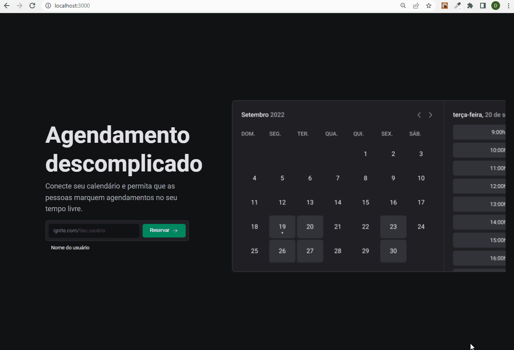
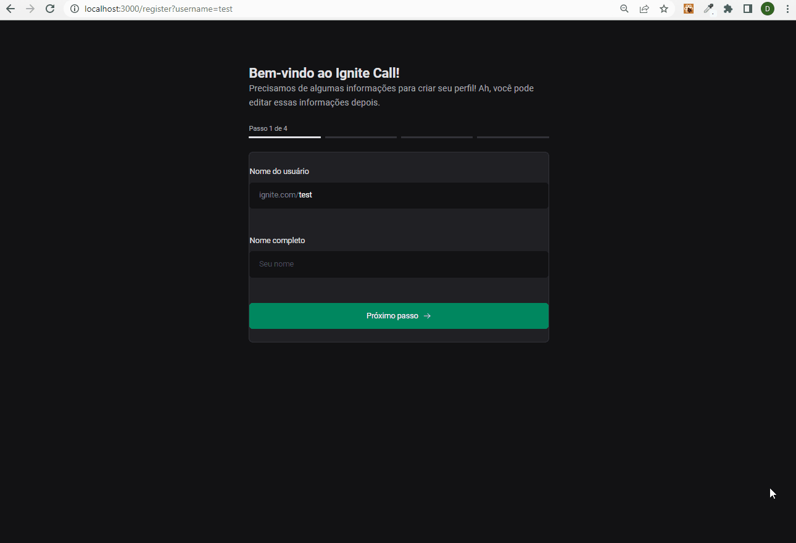
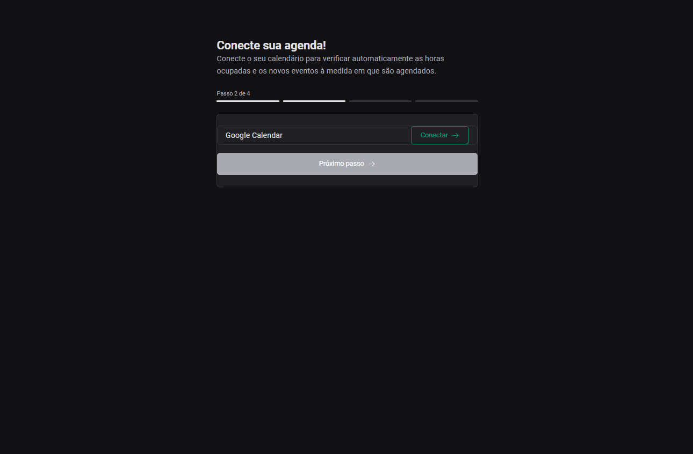
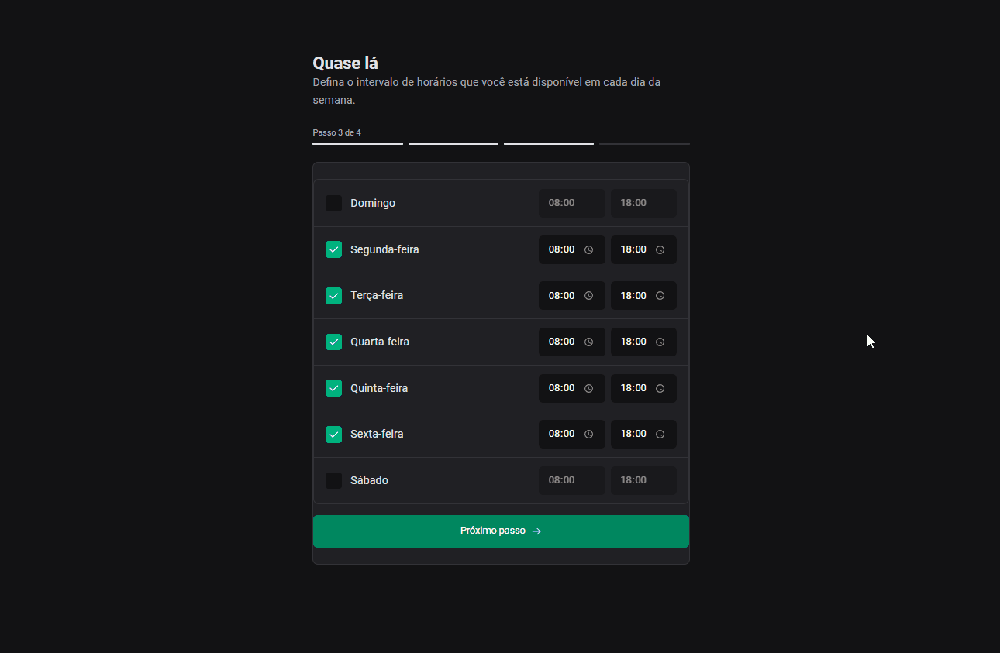
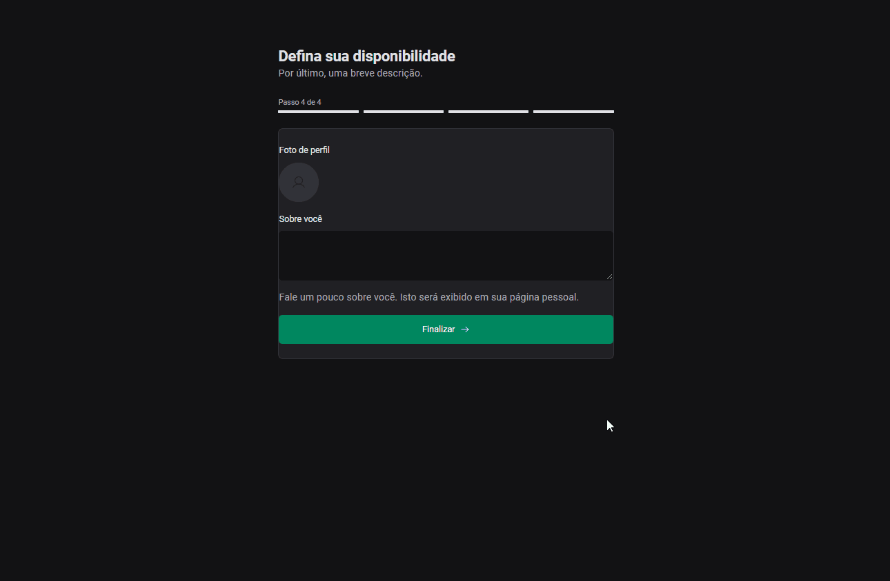
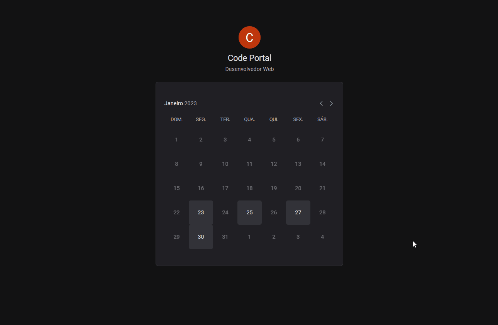
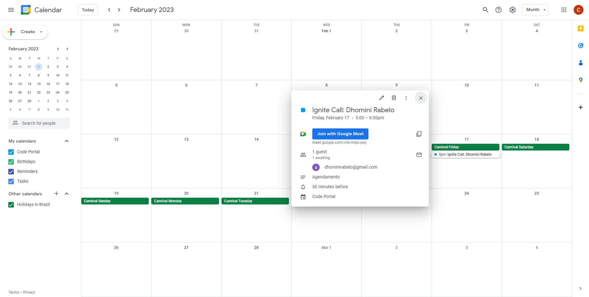

<h1>Estudos Ignite(React) - Etapa 06</h1>

 

Este projeto tem a finalidade de facilitar o agendamento para algum serviço, integrado diretamente com Google Calendar e marcando uma chamada no Meet automaticamente. Nele você cadastra os horários e os dias da semana que você está disponível, depois basta apenas enviar o link de agendamento para 
a pessoa que deseja marcar um horário com você, lá ela pode fazer sua escolhas e informar seus meios de contato.

 
<h3>🚀 Tecnologias</h3>
<ul>
    <li>Next</li>
    <li>next-auth</li>
    <li>googleapis</li>
    <li>nookies</li>
    <li>Tailwind</li>
    <li>Styled-components</li>
    <li>Phosphor-reac</li>
    <li>dayjs</li>
    <li>react-query</li>
    <li>react-hook-form</li>
    <li>zod</li>
    <li>Stitches</li>
    <li>ignite-ui</li>
    <li>prisma</li>
    <li>axios</li>
</ul>

 
<h3>💻 Projeto</h3>

<ul>

<li>
<h3>Home - "/"</h3>

Neste página apenas informamos nosso username

 
<kbd></kbd>
</li>

 
<li>
<h3>Passo 1 do cadastro - "/register?username=test"</h3>
<h3><strong>/api/users</strong></h3>

Nesta página cadastramos nosso usuário com prisma (mysql) apenas com o username e seu nome completo, utilizando as APIs routes.

 
<kbd></kbd>
</li>

 
<li>
<h3>Passo 2 do cadastro - "/register/connect-calendar"</h3>

Nesta página fazemos a autenticação com o Google, a permissão de acesso ao Google Calendar é obrigatória para continuar. Para autenticar com o Google criamos
nosso adapter personalizado(/stage06/src/code/modules/auth/prismaAdapter.ts), isso porque nosso usuário foi criado na rota anterior. Nosso username é enviado
ao nosso adapter através dos cookies, onde manipulamos através da lib nookies.

 
<kbd></kbd>
</li>

 
<li>
<h3>Passo 3 do cadastro - "/register/timer-intervals"</h3>
<h3><strong>/api/users/timer-intervals</strong></h3>

Nesta página cadastramos nossos horários e dias da semana que estamos livre para agendamento. Projetamos a estrutura de dados com zod, fazemos a validação no
backend com zod, e salvamos esses dados na tabela "user_time_intervals".

 
<kbd></kbd>
</li>

 
<li>
<h3>Passo 4 do cadastro - "/register/update-profile"</h3>
<h3><strong>/api/users/update-profile</strong></h3>

Nesta página cadastramos nossa bio e finalizamos o cadastro do usuário.

 
<kbd></kbd>
</li>

 
<li>
<h3>Página de agendamento - "/schedule/[username]"</h3>
<h3><strong>/api/users/[username]/blocked-dates</strong></h3>
<h3><strong>/api/users/[username]/availability</strong></h3>
<h3><strong>/api/users/[username]/scheduling</strong></h3>

Esta é a página que enviamos para alguém marcar horário com o usuário. Para saber os dias e horários que estão disponíveis são consumidas duas APIs, 
além de consumir outra quando salvamos os dados do agendamento.

 
<kbd></kbd>
</li>

 
<li>
<h3>Marcação da reunião</h3>
 
<kbd></kbd>
</li>

</ul>